# Estructura de Base de Datos

## 1. Diagrama Entidad-Relación (ERD)

```mermaid
erDiagram
    APERTURA_Y_CIERRE_DE_CAJA {
        text IDCaja
        text Nombre
        text Apertura
        date Fecha_de_Apertura
        time_without_time_zone Hora_de_Apertura
        money Efectivo_de_Apertura
        date Fecha_de_Cierre
        time_without_time_zone Hora_de_Cierre
        money Efectivo_de_Cierre
        money Resumen
        text pdf
        integer Pdfcount
        text observaciones
        text Cierre
        integer Total_12_Onz
        integer Total_24_Onz
        text Productos
        text Tipo_de_vaso
        integer Cant_A_agregar
        money Plata_Guardada
        text Cuadro_Caja
        money Valor_Faltante
        money Valor_Excedente
        timestamp_without_time_zone Hora_en_la_que_se_actualizo
        integer Contador
        integer Contador_2
    }
    APERTURA_Y_CIERRE_INSUMOS {
        text Idcierreyapertura
        text IDCaja
        text Para_que_producto
        text Nombre_del_Producto
        text Categoria
        text Insumos
        text Nombre_Insumo
        text Unidad_de_medida
        integer Cant_apertura
        timestamp_without_time_zone Fecha_y_hora
        date Fecha
        integer Cant_de_cierre
        integer se_utilizaron
        text Observacion
        integer Agregar_Cant
    }
    CATEGORIAS {
        text IDcategoria
        text Nombre
        text Image
    }
    CATEGORIAS_INSUMOS {
        text IDcategoriainsumos
        text Nombre
        text Imagen
    }
    CLIENTES {
        integer IDcliente
        text Nombre
        bigint Cedula
        text Compras
        timestamp_without_time_zone Fecha_y_hora_creacion
        timestamp_without_time_zone Fecha_y_hora_actualizacion
        text Evento
        text Particpa
        integer Contador
        character_varying Whatsapp
        text Observaciones
    }
    COMENTARIOS {
        text ID
        text Comentarios
        text Tipo
        money Precio
    }
    Dinero_retirado {
        text IDretiro
        text FilterID
        money valor
        money retiro
        money sobrante
        money Total
        timestamp_without_time_zone fecha_y_hora
        text observacion
        text comentario
    }
    Filter {
        text FilterID
        date Desde
        date Hasta
        text Categoria
        text Producto
        money Ingreso_Total
        text pdf
        text Categoria_Alimentos
        text Alimentos
        text pdf2
        date Desde2
        boolean Hasta2
        text TIPO_DE_FILTRO
        date Desde3
        date Hasta3
        text Categoria2
        text Producto2
        integer Numero_de_Unidades_Vendidas
        integer Precio_Total_del_Producto_Vendido
        date Desde4
        date Hasta4
        text pdf3
        money Total_Gastos
        date Desde5
        date Hasta5
        text pdf4
        money Total_Gastos_personales
        date Desde6
        date Hasta6
        text pdf5
        money Total_de_plata_guardada
        date Fecha_Inicio_Ventas
        date Fecha_Final_Ventas
        money Ventas_TOTAL
        money Gastos_TOTAL
        money Inventario_TOTAL
        money Gastos_Personales_TOTAL
        money Utilidad_Negocio
        money Utilidad_Neta
    }
    GASTOS {
        text IDgastos
        text Concepto
        timestamp_without_time_zone Fecha_y_hora
        date Fecha
        money Valor
        text Fotos
        text Medio_de_pago
        text Relacion_con_insumos
    }
    GASTOS_PERSONALES {
        text IDgastos
        text Concepto
        timestamp_without_time_zone Fecha_y_hora
        date Fecha
        money Valor
        text Fotos
        text Medio_de_pago
    }
    HOME {
        text IDhome
        text Menu
        text MostrarRol
        text Icono
        text Vista
        text Accion
        integer Orden
    }
    INSUMOS {
        text IDalimentos
        text Categoria
        text Nombre
        text Unidades
        integer Cantidad
        text imagen
        date fecha_de_vencimiento
        text NombreCategoria
        money Precio
        money Total
        integer Agregar_Cantidad
        date Fecha
        text Descontar_cant_de_ventas
        text Notificar_a_whatsapp
        integer apartir_de_cantidad
        text Enviar_si_o_no
        text Disponible
        integer Contador
        text Image_Url
        text Llevar_control_en_caja
        integer Contador_2
        text imagencard
    }
    INVENTARIO {
        text IDinventario
        text Nombre
        timestamp_without_time_zone Fecha_y_hora
        text Tipo
        money Total
        money Descuento
    }
    MESAS {
        text IdMesas
        text Nombre
    }
    ORDERINVENTARIO {
        text IDorderinventario
        text IDinventario
        text Categoria
        text Nombre_del_Alimento
        integer Cantidad
        text Observacion
        text NombreCategoria
        date Fecha
        money Precio
        money Precio_Actual
        money Subtotal
        money Precio_Anterior
        integer Cant_insumos
        text Agregar_a_Insumos
        text Provedor
        text Telefono_Provedor
        text Direccion_Provedor
        text Disponible
        timestamp_without_time_zone Fecha_y_hora
        text Se_compro
    }
    ORDERVENTAS {
        text IDorderventas
        text IDventas
        text Categoria
        text Nombre
        integer Cantidad
        money Precio
        money Precio_total
        text Estado
        text Comentarios
        text Imagen
        date fecha
        text SALSA
        text HELADO
        text TOPINGS
    }
    PRODUCTOS {
        text IDproductos
        text Categoria
        text Categoria_Nombre
        text Nombre
        text Mostrar
        integer Cantidad
        money Precio_Unitario
        text Image
        text ImagenUrl
        text IDventas
        timestamp_without_time_zone Fecha_de_Cantidad_agregada
        integer Cantidad_Agregada
        money Precio_de_compra
        text Unidades
        text Descontar
        money Stock_Filtro
        text Combo
        text Llevar_control_en_caja
        integer Orden
    }
    PROVEDORES {
        text IDprovedor
        text Nombre
        text Telefono
        text Direccion_y_Ciudad
    }
    RECETAINSUMOS {
        text idinsumos
        text IDproductos
        text Categoria
        text Insumo
        text Tipo_de_medida
        integer Cantidad
    }
    SUBMENU {
        text Idsubmenu
        text IDhome
        text Submenu
        text Rol
        text Imagen
        text Vista
        integer Orden
    }
    USUARIOS {
        text IDUsuarios
        text Nombre
        text email
        integer Cedula
        text Telefono
        text Direccion
        money Propinas
        text Rol
        text Foto
        money Salario
    }
    VENTAS {
        text IDventas
        timestamp_without_time_zone Fecha_y_hora
        text Escanear
        text Producto
        text Estado
        text MESA
        date FECHA
        time_without_time_zone HORA
        money Efectivo_Recibido
        money Devueltas
        text Icon
        text Direccion
        money Costo_del_Domicilio
        text Porcentaje_de_descuento
        money Descuento
        text Medio_de_pago
        text BANCO
        money Valor_de_transferencia
        text Pedido
        text AGREGAR_PRODUCTOS
        text Usuario
        integer Numero_telefono
        text Mensaje
        money TOTAL_INPUT
        text Clente
        text Compras
    }
```

***

## 2. Diccionario de Datos

### Tabla: `APERTURA Y CIERRE DE CAJA`

| Columna                         | Tipo de Dato                  | Longitud / Detalles |
| :------------------------------ | :---------------------------- | :------------------ |
| **IDCaja**                      | `text`                        | -                   |
| **Nombre**                      | `text`                        | -                   |
| **Apertura**                    | `text`                        | -                   |
| **Fecha de Apertura**           | `date`                        | -                   |
| **Hora de Apertura**            | `time without time zone`      | -                   |
| **Efectivo de Apertura**        | `money`                       | -                   |
| **Fecha de Cierre**             | `date`                        | -                   |
| **Hora de Cierre**              | `time without time zone`      | -                   |
| **Efectivo de Cierre**          | `money`                       | -                   |
| **Resumen**                     | `money`                       | -                   |
| **pdf**                         | `text`                        | -                   |
| **Pdfcount**                    | `integer`                     | -                   |
| **observaciones**               | `text`                        | -                   |
| **Cierre**                      | `text`                        | -                   |
| **Total 12 Onz**                | `integer`                     | -                   |
| **Total 24 Onz**                | `integer`                     | -                   |
| **Productos**                   | `text`                        | -                   |
| **Tipo de vaso**                | `text`                        | -                   |
| **Cant A agregar**              | `integer`                     | -                   |
| **Plata Guardada**              | `money`                       | -                   |
| **Cuadro Caja?**                | `text`                        | -                   |
| **Valor Faltante**              | `money`                       | -                   |
| **Valor Excedente**             | `money`                       | -                   |
| **Hora en la que se actualizo** | `timestamp without time zone` | -                   |
| **Contador**                    | `integer`                     | -                   |
| **Contador 2**                  | `integer`                     | -                   |

### Tabla: `APERTURA Y CIERRE INSUMOS`

| Columna                 | Tipo de Dato                  | Longitud / Detalles |
| :---------------------- | :---------------------------- | :------------------ |
| **Idcierreyapertura**   | `text`                        | -                   |
| **IDCaja**              | `text`                        | -                   |
| **Para que producto**   | `text`                        | -                   |
| **Nombre del Producto** | `text`                        | -                   |
| **Categoria**           | `text`                        | -                   |
| **Insumos**             | `text`                        | -                   |
| **Nombre Insumo**       | `text`                        | -                   |
| **Unidad de medida**    | `text`                        | -                   |
| **Cant apertura**       | `integer`                     | -                   |
| **Fecha y hora**        | `timestamp without time zone` | -                   |
| **Fecha**               | `date`                        | -                   |
| **Cant de cierre**      | `integer`                     | -                   |
| **se utilizaron**       | `integer`                     | -                   |
| **Observacion**         | `text`                        | -                   |
| **Agregar Cant**        | `integer`                     | -                   |

### Tabla: `CATEGORIAS`

| Columna         | Tipo de Dato | Longitud / Detalles |
| :-------------- | :----------- | :------------------ |
| **IDcategoria** | `text`       | -                   |
| **Nombre**      | `text`       | -                   |
| **Image**       | `text`       | -                   |

### Tabla: `CATEGORIAS INSUMOS`

| Columna                | Tipo de Dato | Longitud / Detalles |
| :--------------------- | :----------- | :------------------ |
| **IDcategoriainsumos** | `text`       | -                   |
| **Nombre**             | `text`       | -                   |
| **Imagen**             | `text`       | -                   |

### Tabla: `CLIENTES`

| Columna                        | Tipo de Dato                  | Longitud / Detalles |
| :----------------------------- | :---------------------------- | :------------------ |
| **IDcliente**                  | `integer`                     | -                   |
| **Nombre**                     | `text`                        | -                   |
| **Cedula**                     | `bigint`                      | -                   |
| **Compras**                    | `text`                        | -                   |
| **Fecha y hora creacion**      | `timestamp without time zone` | -                   |
| **Fecha y hora actualizacion** | `timestamp without time zone` | -                   |
| **Evento**                     | `text`                        | -                   |
| **Particpa?**                  | `text`                        | -                   |
| **Contador**                   | `integer`                     | -                   |
| **Whatsapp**                   | `character varying`           | -                   |
| **Observaciones**              | `text`                        | -                   |

### Tabla: `COMENTARIOS`

| Columna         | Tipo de Dato | Longitud / Detalles |
| :-------------- | :----------- | :------------------ |
| **ID**          | `text`       | -                   |
| **Comentarios** | `text`       | -                   |
| **Tipo**        | `text`       | -                   |
| **Precio**      | `money`      | -                   |

### Tabla: `Dinero retirado`

| Columna          | Tipo de Dato                  | Longitud / Detalles |
| :--------------- | :---------------------------- | :------------------ |
| **IDretiro**     | `text`                        | -                   |
| **FilterID**     | `text`                        | -                   |
| **valor**        | `money`                       | -                   |
| **retiro**       | `money`                       | -                   |
| **sobrante**     | `money`                       | -                   |
| **Total**        | `money`                       | -                   |
| **fecha y hora** | `timestamp without time zone` | -                   |
| **observacion**  | `text`                        | -                   |
| **comentario**   | `text`                        | -                   |

### Tabla: `Filter`

| Columna                               | Tipo de Dato | Longitud / Detalles |
| :------------------------------------ | :----------- | :------------------ |
| **FilterID**                          | `text`       | -                   |
| **Desde**                             | `date`       | -                   |
| **Hasta**                             | `date`       | -                   |
| **Categoria**                         | `text`       | -                   |
| **Producto**                          | `text`       | -                   |
| **Ingreso Total**                     | `money`      | -                   |
| **pdf**                               | `text`       | -                   |
| **Categoria Alimentos**               | `text`       | -                   |
| **Alimentos**                         | `text`       | -                   |
| **pdf2**                              | `text`       | -                   |
| **Desde2**                            | `date`       | -                   |
| **Hasta2**                            | `boolean`    | -                   |
| **TIPO DE FILTRO**                    | `text`       | -                   |
| **Desde3**                            | `date`       | -                   |
| **Hasta3**                            | `date`       | -                   |
| **Categoria2**                        | `text`       | -                   |
| **Producto2**                         | `text`       | -                   |
| **Numero de Unidades Vendidas**       | `integer`    | -                   |
| **Precio Total del Producto Vendido** | `integer`    | -                   |
| **Desde4**                            | `date`       | -                   |
| **Hasta4**                            | `date`       | -                   |
| **pdf3**                              | `text`       | -                   |
| **Total Gastos**                      | `money`      | -                   |
| **Desde5**                            | `date`       | -                   |
| **Hasta5**                            | `date`       | -                   |
| **pdf4**                              | `text`       | -                   |
| **Total Gastos personales**           | `money`      | -                   |
| **Desde6**                            | `date`       | -                   |
| **Hasta6**                            | `date`       | -                   |
| **pdf5**                              | `text`       | -                   |
| **Total de plata guardada**           | `money`      | -                   |
| **Fecha Inicio Ventas**               | `date`       | -                   |
| **Fecha Final Ventas**                | `date`       | -                   |
| **Ventas TOTAL**                      | `money`      | -                   |
| **Gastos TOTAL**                      | `money`      | -                   |
| **Inventario TOTAL**                  | `money`      | -                   |
| **Gastos Personales TOTAL**           | `money`      | -                   |
| **Utilidad Negocio**                  | `money`      | -                   |
| **Utilidad Neta**                     | `money`      | -                   |

### Tabla: `GASTOS`

| Columna                  | Tipo de Dato                  | Longitud / Detalles |
| :----------------------- | :---------------------------- | :------------------ |
| **IDgastos**             | `text`                        | -                   |
| **Concepto**             | `text`                        | -                   |
| **Fecha y hora**         | `timestamp without time zone` | -                   |
| **Fecha**                | `date`                        | -                   |
| **Valor**                | `money`                       | -                   |
| **Fotos**                | `text`                        | -                   |
| **Medio de pago**        | `text`                        | -                   |
| **Relacion con insumos** | `text`                        | -                   |

### Tabla: `GASTOS PERSONALES`

| Columna           | Tipo de Dato                  | Longitud / Detalles |
| :---------------- | :---------------------------- | :------------------ |
| **IDgastos**      | `text`                        | -                   |
| **Concepto**      | `text`                        | -                   |
| **Fecha y hora**  | `timestamp without time zone` | -                   |
| **Fecha**         | `date`                        | -                   |
| **Valor**         | `money`                       | -                   |
| **Fotos**         | `text`                        | -                   |
| **Medio de pago** | `text`                        | -                   |

### Tabla: `HOME`

| Columna        | Tipo de Dato | Longitud / Detalles |
| :------------- | :----------- | :------------------ |
| **IDhome**     | `text`       | -                   |
| **Menu**       | `text`       | -                   |
| **MostrarRol** | `text`       | -                   |
| **Icono**      | `text`       | -                   |
| **Vista**      | `text`       | -                   |
| **Accion**     | `text`       | -                   |
| **Orden**      | `integer`    | -                   |

### Tabla: `INSUMOS`

| Columna                       | Tipo de Dato | Longitud / Detalles |
| :---------------------------- | :----------- | :------------------ |
| **IDalimentos**               | `text`       | -                   |
| **Categoria**                 | `text`       | -                   |
| **Nombre**                    | `text`       | -                   |
| **Unidades**                  | `text`       | -                   |
| **Cantidad**                  | `integer`    | -                   |
| **imagen**                    | `text`       | -                   |
| **fecha de vencimiento**      | `date`       | -                   |
| **NombreCategoria**           | `text`       | -                   |
| **Precio**                    | `money`      | -                   |
| **Total**                     | `money`      | -                   |
| **Agregar Cantidad**          | `integer`    | -                   |
| **Fecha**                     | `date`       | -                   |
| **Descontar cant de ventas?** | `text`       | -                   |
| **Notificar a whatsapp**      | `text`       | -                   |
| **apartir de cantidad**       | `integer`    | -                   |
| **Enviar si o no**            | `text`       | -                   |
| **Disponible**                | `text`       | -                   |
| **Contador**                  | `integer`    | -                   |
| **Image Url**                 | `text`       | -                   |
| **Llevar control en caja**    | `text`       | -                   |
| **Contador 2**                | `integer`    | -                   |
| **imagencard**                | `text`       | -                   |

### Tabla: `INVENTARIO`

| Columna          | Tipo de Dato                  | Longitud / Detalles |
| :--------------- | :---------------------------- | :------------------ |
| **IDinventario** | `text`                        | -                   |
| **Nombre**       | `text`                        | -                   |
| **Fecha y hora** | `timestamp without time zone` | -                   |
| **Tipo**         | `text`                        | -                   |
| **Total**        | `money`                       | -                   |
| **Descuento**    | `money`                       | -                   |

### Tabla: `MESAS`

| Columna     | Tipo de Dato | Longitud / Detalles |
| :---------- | :----------- | :------------------ |
| **IdMesas** | `text`       | -                   |
| **Nombre**  | `text`       | -                   |

### Tabla: `ORDERINVENTARIO`

| Columna                 | Tipo de Dato                  | Longitud / Detalles |
| :---------------------- | :---------------------------- | :------------------ |
| **IDorderinventario**   | `text`                        | -                   |
| **IDinventario**        | `text`                        | -                   |
| **Categoria**           | `text`                        | -                   |
| **Nombre del Alimento** | `text`                        | -                   |
| **Cantidad**            | `integer`                     | -                   |
| **Observacion**         | `text`                        | -                   |
| **NombreCategoria**     | `text`                        | -                   |
| **Fecha**               | `date`                        | -                   |
| **Precio**              | `money`                       | -                   |
| **Precio Actual**       | `money`                       | -                   |
| **Subtotal**            | `money`                       | -                   |
| **Precio Anterior**     | `money`                       | -                   |
| **Cant insumos**        | `integer`                     | -                   |
| **Agregar a Insumos?**  | `text`                        | -                   |
| **Provedor**            | `text`                        | -                   |
| **Telefono Provedor**   | `text`                        | -                   |
| **Direccion Provedor**  | `text`                        | -                   |
| **Disponible**          | `text`                        | -                   |
| **Fecha y hora**        | `timestamp without time zone` | -                   |
| **Se compro?**          | `text`                        | -                   |

### Tabla: `ORDERVENTAS`

| Columna           | Tipo de Dato | Longitud / Detalles |
| :---------------- | :----------- | :------------------ |
| **IDorderventas** | `text`       | -                   |
| **IDventas**      | `text`       | -                   |
| **Categoria**     | `text`       | -                   |
| **Nombre**        | `text`       | -                   |
| **Cantidad**      | `integer`    | -                   |
| **Precio**        | `money`      | -                   |
| **Precio total**  | `money`      | -                   |
| **Estado**        | `text`       | -                   |
| **Comentarios**   | `text`       | -                   |
| **Imagen**        | `text`       | -                   |
| **fecha**         | `date`       | -                   |
| **SALSA**         | `text`       | -                   |
| **HELADO**        | `text`       | -                   |
| **TOPINGS**       | `text`       | -                   |

### Tabla: `PRODUCTOS`

| Columna                        | Tipo de Dato                  | Longitud / Detalles |
| :----------------------------- | :---------------------------- | :------------------ |
| **IDproductos**                | `text`                        | -                   |
| **Categoria**                  | `text`                        | -                   |
| **Categoria\_Nombre**          | `text`                        | -                   |
| **Nombre**                     | `text`                        | -                   |
| **Mostrar**                    | `text`                        | -                   |
| **Cantidad**                   | `integer`                     | -                   |
| **Precio Unitario**            | `money`                       | -                   |
| **Image**                      | `text`                        | -                   |
| **ImagenUrl**                  | `text`                        | -                   |
| **IDventas**                   | `text`                        | -                   |
| **Fecha de Cantidad agregada** | `timestamp without time zone` | -                   |
| **Cantidad Agregada**          | `integer`                     | -                   |
| **Precio de compra**           | `money`                       | -                   |
| **Unidades**                   | `text`                        | -                   |
| **Descontar**                  | `text`                        | -                   |
| **Stock Filtro**               | `money`                       | -                   |
| **Combo**                      | `text`                        | -                   |
| **Llevar control en caja**     | `text`                        | -                   |
| **Orden**                      | `integer`                     | -                   |

### Tabla: `PROVEDORES`

| Columna                | Tipo de Dato | Longitud / Detalles |
| :--------------------- | :----------- | :------------------ |
| **IDprovedor**         | `text`       | -                   |
| **Nombre**             | `text`       | -                   |
| **Telefono**           | `text`       | -                   |
| **Direccion y Ciudad** | `text`       | -                   |

### Tabla: `RECETAINSUMOS`

| Columna            | Tipo de Dato | Longitud / Detalles |
| :----------------- | :----------- | :------------------ |
| **idinsumos**      | `text`       | -                   |
| **IDproductos**    | `text`       | -                   |
| **Categoria**      | `text`       | -                   |
| **Insumo**         | `text`       | -                   |
| **Tipo de medida** | `text`       | -                   |
| **Cantidad**       | `integer`    | -                   |

### Tabla: `SUBMENU`

| Columna       | Tipo de Dato | Longitud / Detalles |
| :------------ | :----------- | :------------------ |
| **Idsubmenu** | `text`       | -                   |
| **IDhome**    | `text`       | -                   |
| **Submenu**   | `text`       | -                   |
| **Rol**       | `text`       | -                   |
| **Imagen**    | `text`       | -                   |
| **Vista**     | `text`       | -                   |
| **Orden**     | `integer`    | -                   |

### Tabla: `USUARIOS`

| Columna        | Tipo de Dato | Longitud / Detalles |
| :------------- | :----------- | :------------------ |
| **IDUsuarios** | `text`       | -                   |
| **Nombre**     | `text`       | -                   |
| **email**      | `text`       | -                   |
| **Cedula**     | `integer`    | -                   |
| **Telefono**   | `text`       | -                   |
| **Direccion**  | `text`       | -                   |
| **Propinas**   | `money`      | -                   |
| **Rol**        | `text`       | -                   |
| **Foto**       | `text`       | -                   |
| **Salario**    | `money`      | -                   |

### Tabla: `VENTAS`

| Columna                    | Tipo de Dato                  | Longitud / Detalles |
| :------------------------- | :---------------------------- | :------------------ |
| **IDventas**               | `text`                        | -                   |
| **Fecha y hora**           | `timestamp without time zone` | -                   |
| **Escanear**               | `text`                        | -                   |
| **Producto**               | `text`                        | -                   |
| **Estado**                 | `text`                        | -                   |
| **MESA**                   | `text`                        | -                   |
| **FECHA**                  | `date`                        | -                   |
| **HORA**                   | `time without time zone`      | -                   |
| **Efectivo Recibido**      | `money`                       | -                   |
| **Devueltas**              | `money`                       | -                   |
| **Icon**                   | `text`                        | -                   |
| **Direccion**              | `text`                        | -                   |
| **Costo del Domicilio**    | `money`                       | -                   |
| **% de descuento**         | `text`                        | -                   |
| **Descuento**              | `money`                       | -                   |
| **Medio de pago**          | `text`                        | -                   |
| **BANCO**                  | `text`                        | -                   |
| **Valor de transferencia** | `money`                       | -                   |
| **Pedido**                 | `text`                        | -                   |
| **AGREGAR PRODUCTOS**      | `text`                        | -                   |
| **Usuario**                | `text`                        | -                   |
| **Numero telefono**        | `integer`                     | -                   |
| **Mensaje**                | `text`                        | -                   |
| **TOTAL INPUT**            | `money`                       | -                   |
| **Clente**                 | `text`                        | -                   |
| **Compras**                | `text`                        | -                   |

